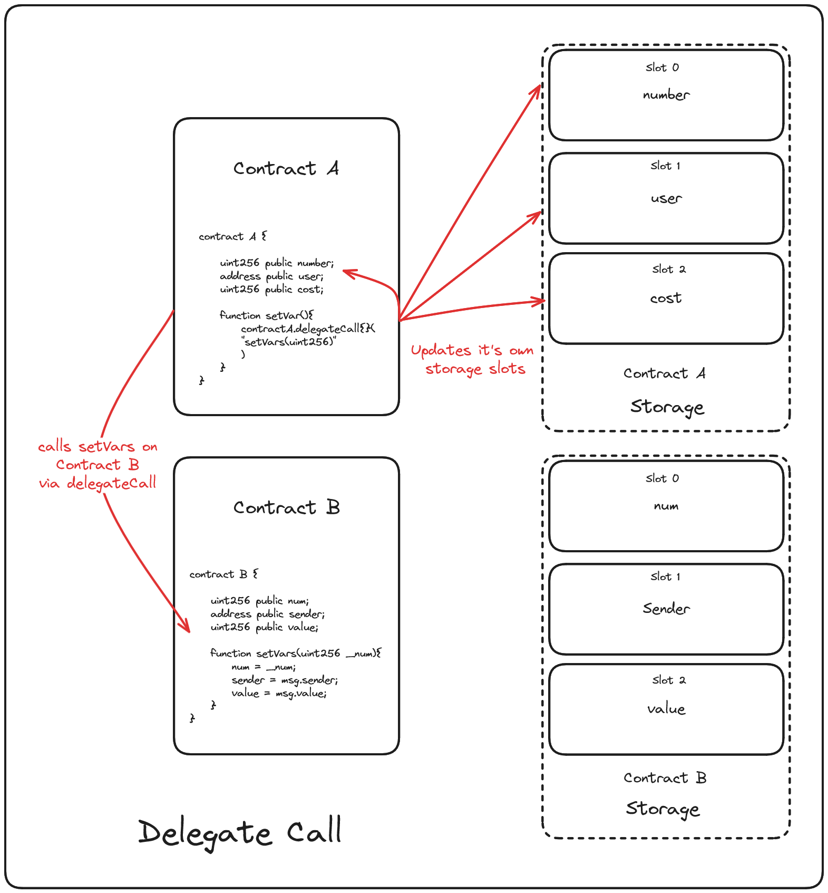

# Delegatecall in Solidity: A Comprehensive Guide
**delegatecall** is a low-level function provided by the Ethereum Virtual Machine (EVM) that allows a contract to execute code from another contract in the context of the calling contract’s storage, **msg.sender**, and **msg.value**. This mechanism is a key building block for upgradeable contracts and code reuse patterns.

## How Does delegatecall Work?
When Contract A uses **delegatecall** to call a function in Contract B:

- **Code Execution:** The code from Contract B is executed.
- **Context Preservation:** The execution context (i.e., storage, caller, value) remains that of Contract A.
- **State Modifications:** Any state changes affect Contract A’s storage—not Contract B’s.
This behavior makes **delegatecall** ideal for proxy patterns where a proxy contract delegates function calls to a separate implementation (or library) contract.

## Code Examples
Below are two examples demonstrating the use of delegatecall:


```solidity
// SPDX-License-Identifier: MIT
pragma solidity ^0.8.26;

// NOTE: Deploy this contract first
contract B {
    // NOTE: storage layout must be the same as contract A
    uint256 public num;
    address public sender;
    uint256 public value;

    function setVars(uint256 _num) public payable {
        num = _num;
        sender = msg.sender;
        value = msg.value;
    }
}

contract A {
    uint256 public num;
    address public sender;
    uint256 public value;

    function setVars(address _contract, uint256 _num) public payable {
        // A's storage is set, B is not modified.
        (bool success, bytes memory data) = _contract.delegatecall(
            abi.encodeWithSignature("setVars(uint256)", _num)
        );
    }
}
```
<div style="display: flex; justify-content: space-between;">
  
  
</div>


In contract A we're doing much the same thing of contract B, the biggest different of course being that we're using `delegateCall`.

This works fundamentally similar to `call`. In the case of `call` we would be calling the `setVars` function on Contract B and this would update the storage on Contract B, as you would expect.

With delegateCall however, we're borrowing the logic from Contract B and referencing the storage of Contract A. This is entirely independent of what the variables are actually named.


1. Using a Fallback Function for a Proxy Pattern
This pattern is common in upgradeable contracts. The proxy contract forwards all calls to the implementation contract.

Library (Implementation) Contract
```solidity

// SPDX-License-Identifier: MIT
pragma solidity ^0.8.0;

/*
 * Note: The storage layout in this contract should match the storage layout in the proxy.
 * In this example, the LibraryContract has a single state variable `number`.
 */
contract LibraryContract {
    // Storage variable that will be used via delegatecall.
    uint public number;

    // Function to set the number.
    function setNumber(uint _num) public {
        number = _num;
    }
}
```

Proxy Contract
```solidity

// SPDX-License-Identifier: MIT
pragma solidity ^0.8.0;

/*
 * The Proxy contract stores the address of the implementation (library) contract.
 * Its storage layout must match the LibraryContract for state variables that are modified
 * via delegatecall. Here, the first variable is the library address and the second is `number`.
 */
contract Proxy {
    // Storage layout: ensure these variables are in the same order as expected by the implementation.
    address public libAddress;
    uint public number;

    constructor(address _libAddress) {
        libAddress = _libAddress;
    }

    // Fallback function that delegates all calls to the implementation contract.
    fallback() external payable {
        _delegate(libAddress);
    }

    // Optional: receive function to handle plain Ether transfers.
    receive() external payable {
        _delegate(libAddress);
    }

    // Internal function that performs the delegatecall.
    function _delegate(address _implementation) internal {
        assembly {
            // Copy msg.data to memory starting at position 0.
            calldatacopy(0, 0, calldatasize())

            // Perform the delegatecall.
            let result := delegatecall(gas(), _implementation, 0, calldatasize(), 0, 0)

            // Retrieve the size of the returned data.
            let size := returndatasize()

            // Copy the returned data.
            returndatacopy(0, 0, size)

            // If the delegatecall failed, revert; otherwise, return the data.
            switch result
            case 0 { revert(0, size) }
            default { return(0, size) }
        }
    }
}
```

2. Direct Use of delegatecall in a Function
In this example, a proxy contract calls a specific function in the library contract using delegatecall directly.

```solidity

// SPDX-License-Identifier: MIT
pragma solidity ^0.8.0;

/*
 * This proxy contract demonstrates a direct delegatecall without a fallback function.
 * The storage layout here is: libAddress (slot 0) and number (slot 1). The implementation
 * must expect the variable to be in slot 1.
 */
contract ProxyDirect {
    address public libAddress;
    uint public number;

    constructor(address _libAddress) {
        libAddress = _libAddress;
    }

    // Function that delegates the call to set the number in the library contract.
    function setNumber(uint _num) public {
        // Encode the function call.
        (bool success, ) = libAddress.delegatecall(
            abi.encodeWithSignature("setNumber(uint256)", _num)
        );
        require(success, "Delegatecall failed");
    }
}
```

## Pros of Using delegatecall
**Upgradeability:**
Enables the proxy pattern, allowing contracts to be upgraded without losing stored state.

**Code Reuse:**
Multiple contracts can share the same logic by delegating calls to a common implementation, reducing deployment costs.

**Flexibility:**
Allows dynamic linking of libraries or logic contracts at runtime.

## Cons of Using delegatecall
- **Storage Layout Sensitivity:**
The calling and called contracts must have an identical storage layout for the variables that are read or written. Mismatches can lead to unpredictable behavior and vulnerabilities.

- **Security Risks:**
Improper use can expose contracts to risks such as:

 - **Arbitrary Code Execution:** If the implementation contract is malicious or compromised.
 - **Reentrancy Attacks:** If the delegatecalled function is not carefully designed.

- **Increased Complexity:**
Debugging and auditing delegatecall patterns can be more challenging due to the indirection and reliance on storage alignment.

- **Gas Overhead:**
While often minimal, delegatecall adds additional gas costs compared to direct calls.

## Best Practices
- **Maintain Consistent Storage Layout:**
Always ensure that the proxy and implementation contracts share the same layout for any state variables that will be used by the delegatecalled functions.

- **Access Control:**
Restrict functions that can update the implementation (library) address to prevent unauthorized upgrades.

- **Security Audits:**
Regularly audit both the proxy and the implementation contracts to catch potential vulnerabilities.

- **Use Fallback Functions Wisely:**
Consider using fallback functions to catch calls that are not explicitly defined in the proxy, ensuring that all intended function calls are properly forwarded.

## Conclusion
delegatecall is a powerful feature in Solidity that, when used correctly, can enable upgradeable contract architectures and efficient code reuse. However, it demands careful attention to storage layout, security best practices, and robust testing to avoid common pitfalls.